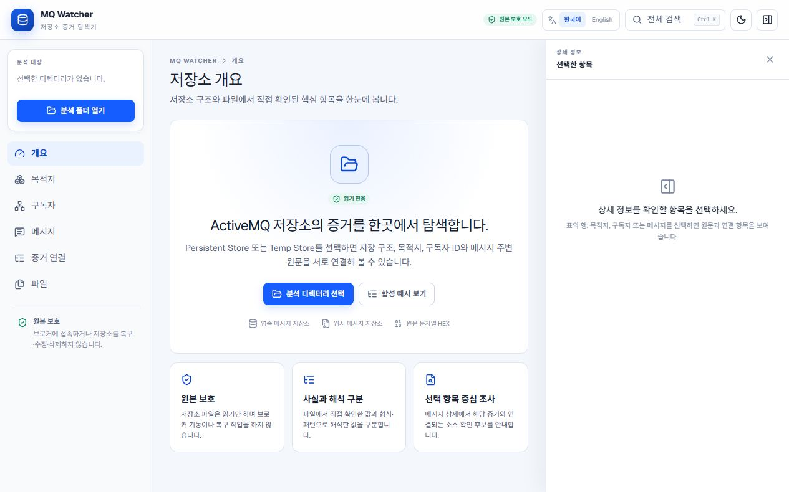
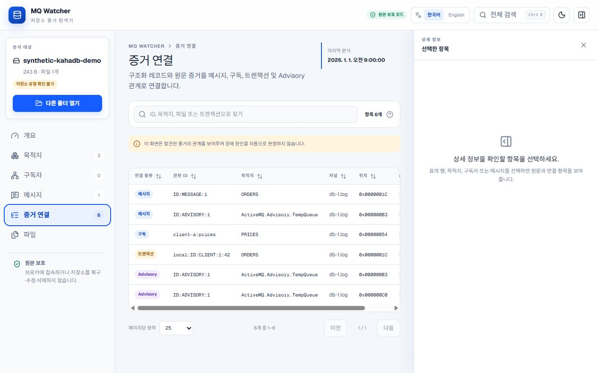
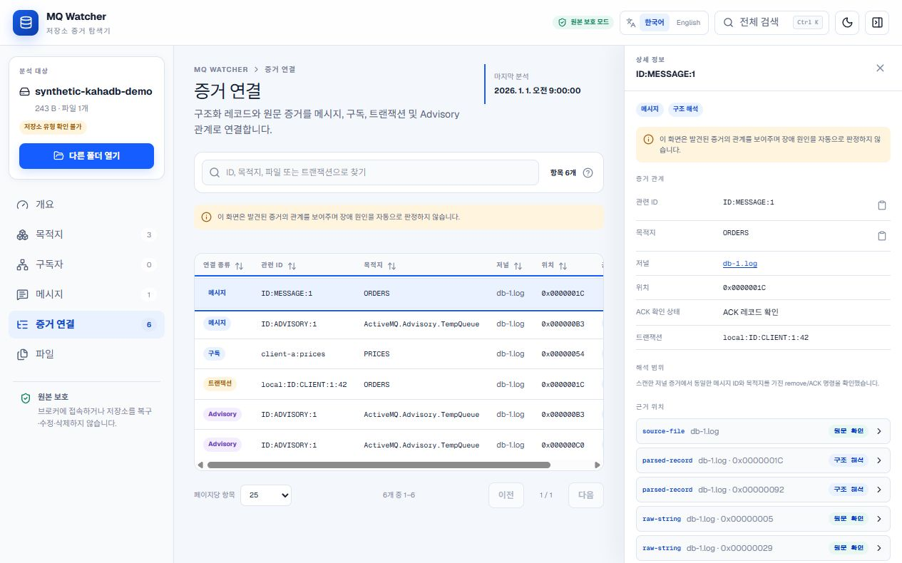

# MQ Watcher

[English](README.md) | 한국어

Apache ActiveMQ Classic 저장소 디렉터리를 로컬에서 읽기 전용으로 살펴보는 증거 탐색 도구입니다.

> **브로커를 기동하지 않습니다. 저장소를 복구하지 않습니다. 파일을 수정하지 않습니다. 외부로 업로드하지 않습니다. 확인 가능한 증거를 우선합니다.**

MQ Watcher는 구조에 따라 해석된 값, 파일에서 직접 관찰된 값, 패턴이 일치한 값, 확인할 수 없는 값을 구분합니다. 장애 원인을 단정하지 않으며, 운영자가 메시지나 구독 정보를 저널 파일과 바이트 위치까지 따라가도록 돕습니다.

이 프로젝트는 독립적인 오픈소스 도구입니다. Apache ActiveMQ 프로젝트 또는 상용 메시징 제품 업체와 제휴 관계가 없으며, 해당 조직의 공식 지원을 받지 않습니다.

## Windows에서 실행

1. [Releases](https://github.com/kutaelee/mq-watcher/releases)에서 `mq-watcher-windows-x64.zip`을 내려받습니다.
2. 압축을 풉니다.
3. `mq-watcher.exe`를 실행합니다.

**설치할 필요가 없으며 Node.js도 필요하지 않습니다.**

## 주요 기능

- 한국어와 영어를 지원하는 ActiveMQ 저장소 증거 탐색 UI
- 구형 또는 지원 범위 밖 저장소를 위한 범위 제한 문자열 스캐너
- KahaDB 저널 배치, 레코드 헤더, 명령 인벨로프, 체크섬과 일부 메타데이터를 소스 구조에 따라 읽는 파서
- 메시지, ACK/삭제, 구독, 트랜잭션, Advisory 간 연결을 살펴보는 증거 관계 화면
- UI를 로컬에서 제공하고 루프백 주소에만 바인딩하는 CLI
- Node.js 없이 실행할 수 있는 Windows/Linux 단독 실행 파일

## 만든 이유

브로커 저장소를 잘못된 런타임이나 복구 절차로 열면 분석 대상이 바뀔 수 있습니다. 원문 문자열 검색은 비교적 안전하지만 의미를 과도하게 해석하기 쉽습니다. MQ Watcher는 엄격한 읽기 전용 접근, 재현 가능한 fixture 테스트, 바이트 단위 근거 위치와 명시적인 해석 한계를 함께 제공하여 두 방식 사이의 간격을 줄입니다.

이 도구는 중단된 Consumer를 자동 진단하거나, 브로커 저장소 손상을 입증하거나, 저장소를 복구하지 않습니다. 특정 레코드가 보이지 않는다는 이유만으로 해당 사건이 발생하지 않았다고 판단하지도 않습니다.

## 안전 원칙

- UI는 디렉터리에 대한 읽기 전용 권한만 요청합니다.
- 저장소 파일은 브라우저 Worker가 제한된 크기의 청크로 읽습니다.
- CLI는 `127.0.0.1`에만 바인딩되며 저장소 업로드 API를 제공하지 않습니다.
- 브로커 연결, 제품 JAR 로딩, 저장소 복구·압축·이름 변경·삭제·수정을 수행하지 않습니다.
- fixture 테스트는 스캔 전후 모든 원본의 해시를 비교하며 바이트가 달라지면 실패합니다.
- 인식하지 못한 구조와 값은 `Unknown`, `Unsupported`, `Partial`로 남깁니다.

운영 환경에서 반출한 데이터를 살펴보기 전에 [보안 및 개인정보 보호 안내](SECURITY.md)를 확인하십시오.

## 다른 실행 방법

### 포터블 배포판 상세 안내

GitHub Release에서 `mq-watcher-windows-x64.zip`과 `SHA256SUMS.txt`를 내려받아 해시를 확인한 뒤 압축을 풀고 실행합니다.

```text
mq-watcher.exe
```

실행 파일은 `127.0.0.1`에만 바인딩된 로컬 서버를 사용 가능한 포트에서 시작하고 브라우저를 엽니다. 브라우저 자동 실행을 막으려면 `--no-open`을 사용합니다. 패키징된 애플리케이션은 `%LOCALAPPDATA%\MQ Watcher\Cache\<version-hash>` 아래에 검증 후 압축 해제되며, 사용자가 선택한 브로커 저장소는 이 캐시로 복사되지 않습니다. 현재 배포 파일에는 코드 서명이 없으므로 Windows SmartScreen 경고가 나타날 수 있습니다.

Linux에서는 `mq-watcher-linux-x64.tar.gz`의 압축을 풀고 `./mq-watcher`를 실행합니다.

### 개발자 설치 (Node.js / 소스 코드)

Node.js 22.13 이상과 File System Access API를 지원하는 최신 Chromium 계열 브라우저가 필요합니다.

소스 코드에서 실행하려면 다음 명령을 사용합니다.

```bash
git clone https://github.com/kutaelee/mq-watcher.git
cd mq-watcher
npm ci
npm run build
node bin/mq-watcher.mjs
```

출력된 `http://localhost:<port>` 주소를 열어 사용합니다. 로컬 파일을 선택하지 않고 공개 fixture를 살펴보려면 **합성 예시 보기**를 선택합니다.

npm 패키지는 배포 가능한 상태이지만 현재 저장소의 자동화 작업에서는 아직 npm registry에 배포하지 않습니다. 별도 승인 후 registry에 배포되면 다음 명령으로 실행하는 구성을 목표로 합니다.

```bash
npx mq-watcher
```

## 지원 저장소 및 버전

| ActiveMQ | 저장소 | Fixture | 파서 | 상태 |
| --- | --- | --- | --- | --- |
| 5.13.5 | KahaDB `db-*.log` | 실제 브로커로 생성한 Queue, ACK, 트랜잭션, durable Topic | 구조화 framing 및 일부 command 메타데이터 | 브로커 fixture 검증 완료 |
| 5.15.16 | KahaDB `db-*.log` | 실제 브로커로 생성한 Queue, ACK, 트랜잭션, durable Topic | 구조화 framing 및 일부 command 메타데이터 | 브로커 fixture 검증 완료 |
| 5.18.7 | KahaDB `db-*.log` | 실제 브로커로 생성한 Queue, ACK, 트랜잭션, durable Topic | 구조화 framing 및 일부 command 메타데이터 | 브로커 fixture 검증 완료 |
| 미지정 | 구형 AMQ Message Store 구조 | 합성 scanner fixture | 파일명/문자열 heuristic | 일부 지원, 버전 **미검증** |
| 미지정 | Temporary/PList 계열 구조 | 합성 scanner fixture | 파일명/문자열 heuristic | 일부 지원, 버전 **미검증** |

구조화된 바이트 해석 규칙과 공식 소스 링크는 [KahaDB 구조화 파싱 범위](docs/structured-parsing.md)에 정리되어 있습니다.

## Parsed, Pattern Match, Observed 구분

| 표시 | 의미 |
| --- | --- |
| `Parsed` | 바이트가 문서화된 형식 규칙을 만족했으며 지원 범위 안에서 해석되었습니다. |
| `Observed` | 파일명 또는 원문 값이 직접 확인되었지만 전체 의미까지 부여하지 않았습니다. |
| `Pattern Match` | 알려진 형식과 유사한 문자열 또는 주변 문맥이 일치했으며 추가 확인이 필요합니다. |
| `Unknown` | 현재 증거만으로는 지원되는 값을 정할 수 없습니다. |

`Partial`과 `Unsupported`는 파서의 지원 범위 또는 실패 처리 상태를 나타냅니다. 저장소 자체에 문제가 있다는 의미가 아닙니다.

## 화면 예시

모든 화면은 저장소에 포함된 합성 fixture를 사용했습니다. 고객사 또는 운영 데이터는 포함하지 않습니다.







## 사용 흐름

1. MQ Watcher를 로컬에서 실행하고 출력된 루프백 주소를 엽니다.
2. 먼저 합성 예시를 확인하거나, 복사본 또는 스냅샷으로 확보한 저장소 디렉터리를 읽기 전용으로 선택합니다.
3. 저장소 분류와 경고를 확인합니다. `Unknown Store Layout`도 정상적인 분석 결과입니다.
4. **증거 연결**에서 메시지, 구독, 트랜잭션 또는 Advisory 항목을 선택합니다.
5. 원본 파일, 바이트 위치, 구조화 레코드, 주변 원문 문자열까지 연결된 근거를 따라갑니다.
6. 도구의 결과만으로 원인을 단정하지 않습니다. 로그, 운영 설정, 실제 배포된 ActiveMQ 버전과 함께 비교합니다.

## Fixture 검증

공개 fixture에는 합성한 경계 조건과 실제 ActiveMQ Classic 5.13.5, 5.15.16, 5.18.7 브로커로 생성한 저장소가 포함됩니다. 실제 브로커 fixture는 영속 Queue 메시지, ACK가 완료된 Queue 메시지, commit된 로컬 트랜잭션, offline durable Topic 메시지를 생성합니다.

```bash
npm run fixtures:generate
npm run test:fixtures
npm run test:broker-fixtures
```

Golden 결과는 항상 같은 순서와 값으로 생성되며, 결과 집합의 크기는 제한됩니다. 스캔 전후 원본 해시가 달라지면 테스트가 실패합니다. 자세한 내용은 [fixtures 안내](fixtures/README.md)와 [단계별 검증 기록](docs/validation)을 참고하십시오.

정확한 artifact 및 journal 해시는 [실제 브로커 fixture 검증](docs/validation/broker-generated-fixtures.md), 압축 해제·바인딩·smoke test 동작은 [포터블 배포 안내](docs/portable-release.md)에 정리되어 있습니다.

## 알려진 제한사항

- OpenWire 메시지 본문과 page-file index는 해석하지 않습니다.
- 저널 증거만으로 현재 메시지가 pending인지 ACK 처리되었는지 확정할 수 없습니다.
- 손상 복구와 레코드 재동기화는 의도적으로 수행하지 않습니다.
- 선택한 디렉터리에 과거 저널 파일 또는 외부 증거가 빠져 있을 수 있습니다.
- 브라우저 캐시에는 원본 파일이 아니라 분석 결과가 저장되지만, 운영 환경의 식별자가 포함될 수 있습니다.
- 실제 브로커 fixture는 문서화된 시나리오와 일부 저널 메타데이터만 검증합니다. 모든 ActiveMQ patch release, OpenWire 본문, page index, 복구 경로에 대한 호환성을 보장하지 않습니다.
- CI는 Node.js 22.13.0을 사용해 Ubuntu와 Windows에서 테스트를 실행하며, 필요한 Java 런타임으로 브로커 fixture를 다시 생성합니다.

## 보안 및 개인정보 보호

스캔된 목적지, ID, 원문 문자열, 화면 캡처, 브라우저에 캐시된 결과에는 민감한 정보가 포함될 수 있습니다. 통제된 작업 환경에서 사용하고, 필요하면 사이트 데이터를 지우며, 이미지나 보고서를 공유하기 전에 내용을 반드시 확인하십시오. IndexedDB와 취약점 제보 절차는 [SECURITY.md](SECURITY.md)를 참고하십시오.

## 개발

```bash
npm ci
npm run dev
```

개발 서버의 기본 주소는 `http://localhost:3000`입니다. 기여 규칙, 파서 지원 범위, fixture 요구사항은 [CONTRIBUTING.md](CONTRIBUTING.md)에 있습니다.

## 테스트

```bash
npm run lint
npm run build
npm test
npm run test:fixtures
npm run test:broker-fixtures
npm run build:portable
npm run test:portable
npm pack --dry-run
```

CI는 Windows와 Ubuntu에서 설치, lint, build, 전체 테스트, fixture 테스트를 실행합니다. 태그 빌드는 단독 실행 파일을 다시 빌드하고 smoke test를 통과한 뒤 압축 파일과 `SHA256SUMS.txt`를 배포합니다.

## 라이선스

[MIT](LICENSE)
