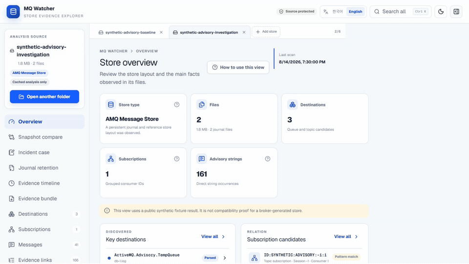
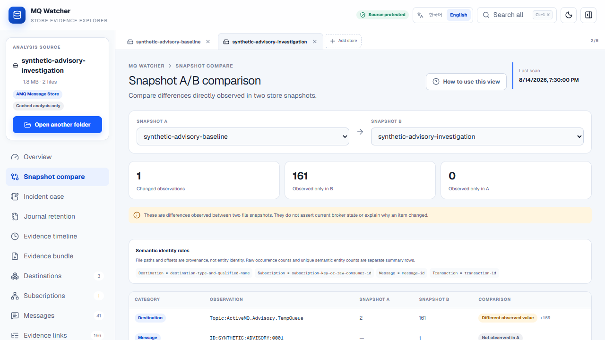
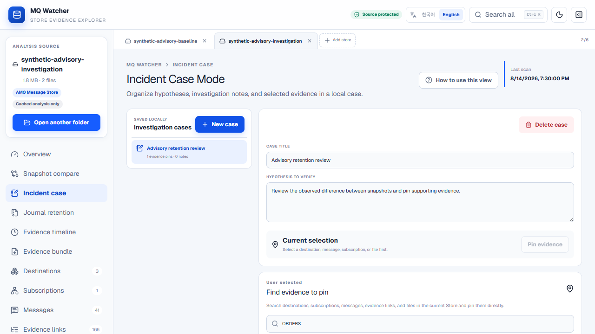
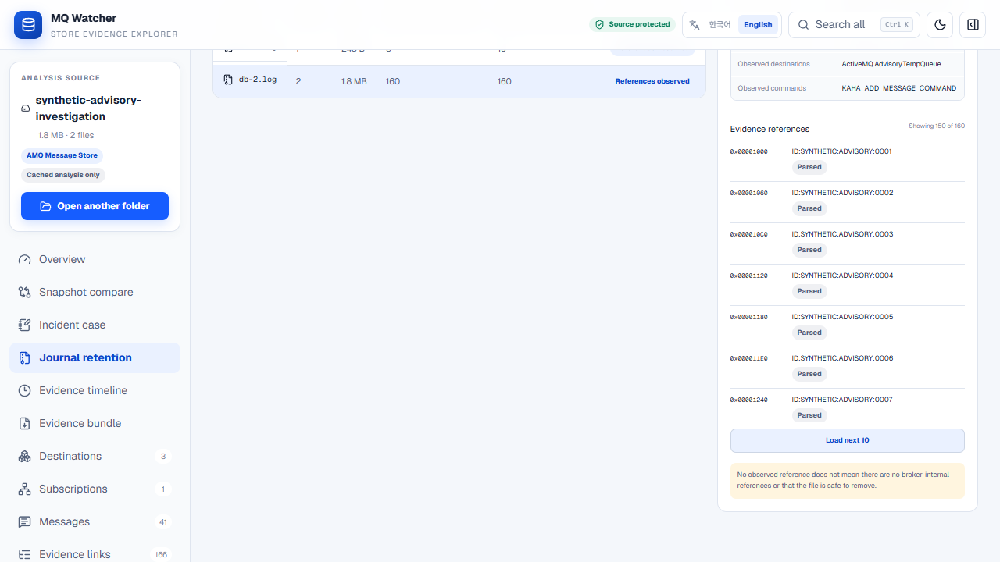
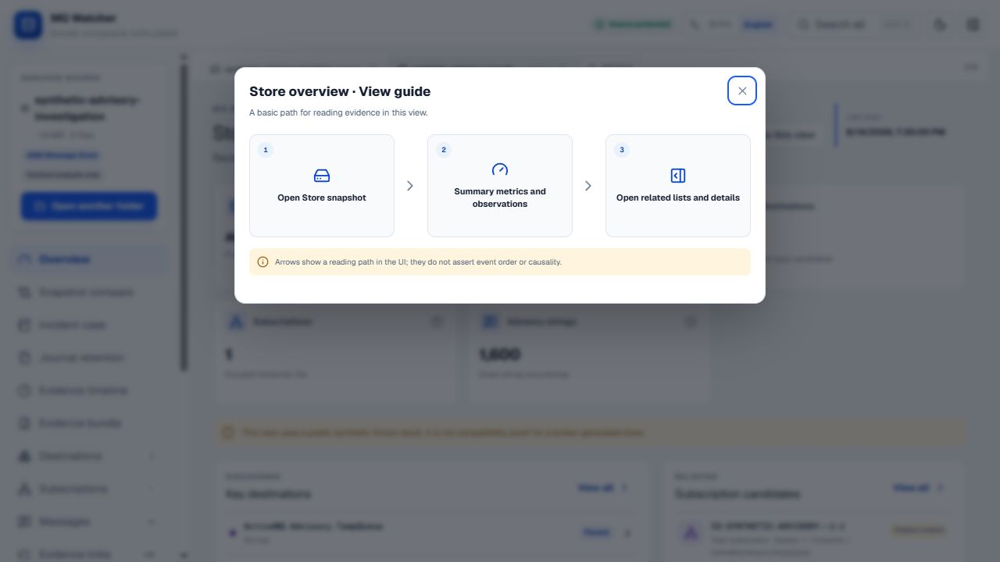

# MQ Watcher

English | [한국어](README.ko.md)

Local, read-only evidence explorer for Apache ActiveMQ Classic store directories.

> **No broker startup. No store recovery. No writes. No uploads. Evidence first.**

MQ Watcher separates structured facts, raw observations, pattern matches, and unknowns. It helps an operator follow a message or subscription back to a journal file and byte offset without claiming to know the outage cause.

This is an independent open-source tool. It is not affiliated with or supported by the Apache ActiveMQ project or a commercial messaging vendor.

## Run on Windows

1. Download `mq-watcher-windows-x64.zip` from [Releases](https://github.com/kutaelee/mq-watcher/releases).
2. Extract the archive.
3. Run `mq-watcher.exe`.

**No installation. No Node.js required.**

## Guided tour

The walkthrough below uses only the committed synthetic Advisory scenario. It shows the investigation flow without customer data or a connection to a broker.



[Watch the MP4 walkthrough](docs/media/en/mq-watcher-walkthrough.mp4) · [Open the complete English feature guide](docs/user-guide.md)

| Compare two snapshots | Build a local incident case |
| --- | --- |
|  |  |

Each analysis page includes **How to use this view**, a three-step visual reading path, and an explicit statement of what the page does not prove.

## What it is

- A Korean/English browser UI for local ActiveMQ store evidence
- A bounded printable-string scanner for legacy or unsupported layouts
- A source-based parser for KahaDB journal batches, record headers, command envelopes, checksums, and selected metadata
- An evidence-correlation view for message, ACK/remove, subscription, transaction, and Advisory relationships
- A six-part investigation workbench for multiple Stores, snapshot comparison, incident notes, journal review, evidence ordering, and redacted export
- A loopback-only CLI that serves the UI locally
- A standalone Windows/Linux executable that does not require Node.js

## Investigation workbench

The workbench organizes evidence without turning observations into an automated root-cause verdict:

1. **Multi-Store tabs** — open up to six Store analyses. On explicit open, a Worker reads the selected files in bounded chunks and derives a content-based SHA-256 signature; the directory display name is not the identity. Ordinary tab and view interactions reuse that signature. Closing a tab cancels and releases its task-owned Worker, request, listener, timer, and object URL resources.
2. **Snapshot A/B comparison** — compare semantic entities by documented keys such as destination type/name, subscription key, message ID, and transaction ID. File paths and offsets remain provenance, not identity. Raw occurrences and unique semantic entities are reported separately.
3. **Incident Case Mode** — keep local hypotheses, notes, and pinned evidence. References use Store signature, semantic evidence key, and provenance, and remain visibly unresolved when the referenced Store or evidence is unavailable after reload.
4. **Journal Retention Explorer** — reverse-index observed records and evidence references by journal file. It shows where evidence was observed; it does not decide why a journal was retained or whether it is currently in use.
5. **Evidence Timeline** — order records only by offset within each journal. MQ Watcher does not invent a global time order between different journal files.
6. **Evidence Bundle Export** — build a cancellable ZIP in a Worker with progress, optional centralized redaction, a manifest, and per-entry SHA-256 values. The bundle contains derived evidence, not the selected Store files.

Investigation Leads are presented as relevance prompts. Every lead explains why it was surfaced and what it does **not** prove; it is not an anomaly score or a root-cause score.

## Why it exists

Opening a broker store with the wrong runtime or recovery path can change evidence. Raw string searches are safer but easy to over-interpret. MQ Watcher provides a middle ground: strict read-only access, reproducible fixture tests, byte-level references, and explicit interpretation limits.

It does **not** diagnose a crashed consumer, prove broker corruption, recover a store, or assert that a missing record means an event never occurred.

## Safety model

- The UI requests read-only directory handles.
- Store files are read in bounded chunks by a browser Worker.
- The CLI binds only to `127.0.0.1` and has no store-upload endpoint.
- The tool does not connect to a broker, load product JARs, start recovery, compact, rename, delete, or modify store files.
- Fixture tests hash every source before and after scanning and fail if bytes change.
- Cached analysis remains available when File System permission is unavailable; source-dependent rescanning remains unavailable until permission is granted again.
- Unrecognized layouts and values remain `Unknown`, `Unsupported`, or `Partial`.

See [Security and privacy](SECURITY.md) before examining production-derived data.

## Other ways to run

### Portable release details

Download `mq-watcher-windows-x64.zip` from the GitHub Release, verify it against `SHA256SUMS.txt`, extract it, and run:

```text
mq-watcher.exe
```

The executable starts a server bound only to `http://127.0.0.1:38921` and opens the browser. The stable origin lets browser-local sessions, cached analysis, cases, language, and UI state survive executable restarts. Use `--no-open` to suppress browser launch or `--port 0` for an intentionally ephemeral workspace. The packaged application is verified and extracted under `%LOCALAPPDATA%\MQ Watcher\Cache\<version-hash>`; selected broker stores are not copied into that cache. The release executable is currently unsigned, so Windows SmartScreen may show a warning.

### Updates

When the UI opens, MQ Watcher checks the repository's fixed GitHub Releases API endpoint for the latest stable version. This metadata request sends the application version in its user agent; it does not send Store paths, names, file bytes, cached analysis, or case notes. It does not download release assets until the user selects **Verify and update**.

Automatic replacement is supported only by the Windows x64 portable executable. Source, npm, Linux, unsupported architecture, draft, pre-release, downgrade, or incomplete release-asset cases remain manual or blocked. Before replacement, the updater restricts release and redirect locations, checks declared sizes, verifies `SHA256SUMS.txt` and release SHA-256 metadata, stages the file beside the current executable, smoke-checks its version, and rolls back on replacement failure. See [Portable release and updater](docs/portable-release.md) for the exact boundary and current validation status.

Linux users can extract `mq-watcher-linux-x64.tar.gz` and run `./mq-watcher`.

### Developer installation (Node.js / source)

Requires Node.js 22.13 or newer and a current Chromium-based browser with the File System Access API.

From a source checkout:

```bash
git clone https://github.com/kutaelee/mq-watcher.git
cd mq-watcher
npm ci
npm run build
node bin/mq-watcher.mjs
```

Open the printed `http://127.0.0.1:38921` URL. Choose **Load synthetic demo** to explore public fixture evidence without selecting local files.

The npm package is publish-ready but has not been published by this repository workflow. After a separately approved registry release, the intended command is:

```bash
npx mq-watcher
```

## Supported stores / versions

| ActiveMQ | Store | Fixture | Parser | Status |
| --- | --- | --- | --- | --- |
| 5.13.5 | KahaDB `db-*.log` | Broker-generated Queue, ACK, transaction, durable Topic | Structured framing and selected command metadata | Broker fixture verified |
| 5.15.16 | KahaDB `db-*.log` | Broker-generated Queue, ACK, transaction, durable Topic | Structured framing and selected command metadata | Broker fixture verified |
| 5.18.7 | KahaDB `db-*.log` | Broker-generated Queue, ACK, transaction, durable Topic | Structured framing and selected command metadata | Broker fixture verified |
| Unspecified | Legacy AMQ Message Store layout | Synthetic scanner fixture | Filename/string heuristic | Partial; version **Not verified** |
| Unspecified | Temporary/PList-style layout | Synthetic scanner fixture | Filename/string heuristic | Partial; version **Not verified** |

The structured byte rules and official source links are documented in [Structured KahaDB parsing boundary](docs/structured-parsing.md).

## Parsed vs Pattern Match vs Observed

| Label | Meaning |
| --- | --- |
| `Parsed` | Bytes satisfied a documented format rule and were decoded within the supported boundary. |
| `Observed` | A filename or raw value was directly present, without assigning full semantic meaning. |
| `Pattern Match` | A string matched a known-looking expression or nearby context and requires confirmation. |
| `Unknown` | Available evidence was insufficient to assign a supported value. |

`Partial` and `Unsupported` describe parser coverage or failure behavior; they are not evidence that the store itself is defective.

## Screenshots

All screenshots and videos use the committed synthetic fixture. They contain no customer or operating data. See the [complete English feature guide](docs/user-guide.md) for page-by-page instructions and examples.

| Journal references with progressive loading | Visual page guide |
| --- | --- |
|  |  |

## Example workflow

1. Start MQ Watcher locally and open the printed loopback URL.
2. Use the synthetic demo first, or choose a copied/snapshotted store directory with read-only access.
3. Review the store classification and warnings; `Unknown Store Layout` is a valid result.
4. Open **Evidence links** and select a message, subscription, transaction, or Advisory.
5. Follow its references to the source file, offset, parsed record, and nearby raw strings.
6. Export no conclusions automatically. Compare the evidence with logs, runtime configuration, and the exact deployed ActiveMQ version.

## Fixture validation

Public fixtures include synthetic edge cases and stores generated by real embedded ActiveMQ Classic 5.13.5, 5.15.16, and 5.18.7 brokers. The broker cases create a persistent Queue message, an acknowledged Queue message, a committed local transaction, and an offline durable Topic message.

```bash
npm run fixtures:generate
npm run test:fixtures
npm run test:broker-fixtures
```

Golden results are deterministic, result collections are bounded, and before/after source hashes must match. See [fixtures/README.md](fixtures/README.md) and the phase records under [docs/validation](docs/validation).

See [broker-generated fixture validation](docs/validation/broker-generated-fixtures.md) for exact artifact and journal hashes, and [portable release](docs/portable-release.md) for extraction, binding, and smoke-test details.

## Known limitations

- OpenWire message bodies and page-file indexes are not decoded.
- Journal evidence alone cannot prove current pending/acknowledged state.
- Corruption recovery and resynchronization are intentionally not performed.
- A selected directory may omit older journal files or external evidence.
- The browser cache contains analysis results, not original files, but those results can still contain operational identifiers.
- Redaction reduces accidental disclosure in an exported bundle but is not a guarantee that every operationally sensitive value has been recognized. Review a bundle before sharing it.
- Update checks require network access to GitHub. Automatic replacement is limited to the supported Windows x64 portable distribution; other distributions link to the release page for manual update.
- Broker-generated fixtures validate only the documented scenarios and selected journal metadata; they do not certify every ActiveMQ patch release, OpenWire body, page index, or recovery path.
- CI validates the test suite on Ubuntu and Windows with Node 22.13.0 and regenerates the broker fixtures with the required Java runtime.

## Security / privacy

Scanned destinations, IDs, raw strings, screenshots, and browser-cached results may be sensitive. Use a controlled workstation, clear site data when appropriate, and review every image or report before sharing. See [SECURITY.md](SECURITY.md) for IndexedDB and vulnerability-reporting details.

## Development

```bash
npm ci
npm run dev
```

The development server defaults to `http://localhost:3000`. Contribution rules, parser boundaries, and fixture requirements are in [CONTRIBUTING.md](CONTRIBUTING.md).

## Testing

```bash
npm run lint
npm run typecheck
npm run build
npm test
npm run test:fixtures
npm run test:broker-fixtures
npm run test:portable-cache
npm run test:e2e:indexeddb
npm run build:portable
npm run test:portable
npm pack --dry-run
```

CI runs install, lint, strict type checking, build, the full test suite, fixture tests, broker-fixture tests, portable-cache tests, and the real Chromium IndexedDB migration test on Windows and Ubuntu where configured. Tag builds also rebuild and smoke-test the standalone executables before publishing archives and `SHA256SUMS.txt`. See the completed [v0.3 workbench validation](docs/validation/v0.3-investigation-workbench.md) and the current [v0.3.1 usability validation](docs/validation/v0.3.1-usability.md).

## License

[MIT](LICENSE)
