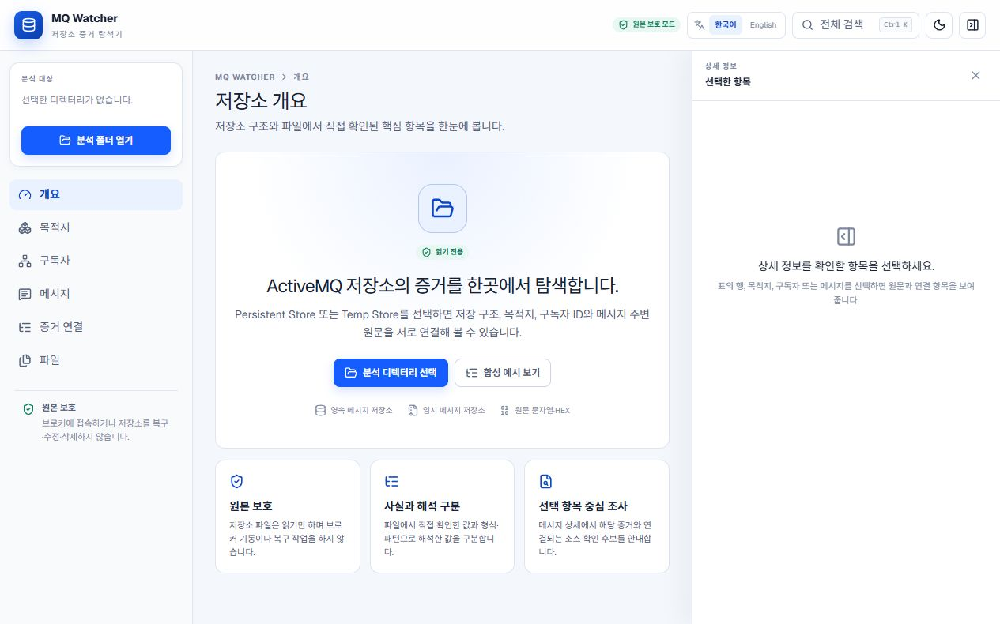
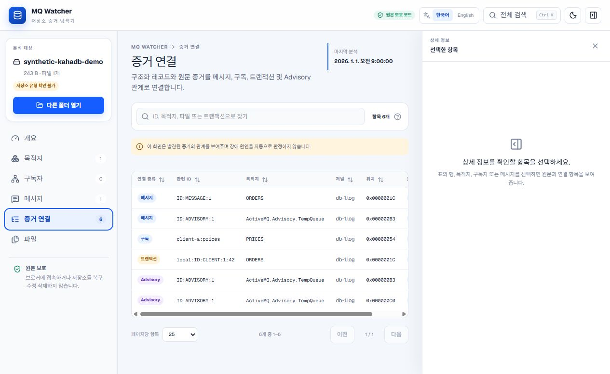
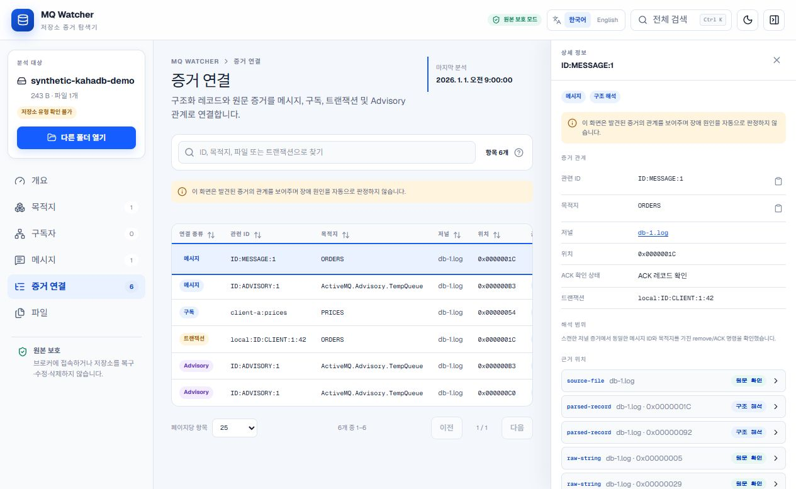

# MQ Watcher

Local, read-only evidence explorer for Apache ActiveMQ Classic store directories.

> **No broker startup. No store recovery. No writes. No uploads. Evidence first.**

MQ Watcher separates structured facts, raw observations, pattern matches, and unknowns. It helps an operator follow a message or subscription back to a journal file and byte offset without claiming to know the outage cause.

This is an independent open-source tool. It is not affiliated with or supported by the Apache ActiveMQ project or a commercial messaging vendor.

## What it is

- A Korean/English browser UI for local ActiveMQ store evidence
- A bounded printable-string scanner for legacy or unsupported layouts
- A source-based parser for KahaDB journal batches, record headers, command envelopes, checksums, and selected metadata
- An evidence-correlation view for message, ACK/remove, subscription, transaction, and Advisory relationships
- A loopback-only CLI that serves the UI locally

## Why it exists

Opening a broker store with the wrong runtime or recovery path can change evidence. Raw string searches are safer but easy to over-interpret. MQ Watcher provides a middle ground: strict read-only access, reproducible fixture tests, byte-level references, and explicit interpretation limits.

It does **not** diagnose a crashed consumer, prove broker corruption, recover a store, or assert that a missing record means an event never occurred.

## Safety model

- The UI requests read-only directory handles.
- Store files are read in bounded chunks by a browser Worker.
- The CLI binds only to `127.0.0.1` and has no store-upload endpoint.
- The tool does not connect to a broker, load product JARs, start recovery, compact, rename, delete, or modify store files.
- Fixture tests hash every source before and after scanning and fail if bytes change.
- Unrecognized layouts and values remain `Unknown`, `Unsupported`, or `Partial`.

See [Security and privacy](SECURITY.md) before examining production-derived data.

## Quick start

Requires Node.js 22.13 or newer and a current Chromium-based browser with the File System Access API.

From a source checkout:

```bash
git clone https://github.com/kutaelee/mq-watcher.git
cd mq-watcher
npm ci
npm run build
node bin/mq-watcher.mjs
```

Open the printed `http://localhost:<port>` URL. Choose **Load synthetic demo** to explore public fixture evidence without selecting local files.

The npm package is publish-ready but has not been published by this repository workflow. After a separately approved registry release, the intended command is:

```bash
npx mq-watcher
```

## Supported stores / versions

No broker-generated redistributable fixture is currently committed, so no ActiveMQ release is marked runtime-verified.

| ActiveMQ | Store | Fixture | Parser | Status |
| --- | --- | --- | --- | --- |
| 5.15.16 source layout | KahaDB `db-*.log` | Synthetic source-conformance bytes | Structured framing and selected command metadata | Partial; runtime **Not verified** |
| 5.18.7 source layout | KahaDB `db-*.log` | Synthetic source-conformance bytes | Structured framing and selected command metadata | Partial; runtime **Not verified** |
| Current Apache source snapshot | KahaDB `db-*.log` | Synthetic source-conformance bytes | Structured framing and selected command metadata | Partial; runtime **Not verified** |
| Unspecified | Legacy AMQ Message Store layout | Synthetic scanner fixture | Filename/string heuristic | Partial; version **Not verified** |
| Unspecified | Temporary/PList-style layout | Synthetic scanner fixture | Filename/string heuristic | Partial; version **Not verified** |

The structured byte rules and official source links are documented in [Structured KahaDB parsing boundary](docs/structured-parsing.md).

## Parsed vs Pattern Match vs Observed

| Label | Meaning |
| --- | --- |
| `Parsed` | Bytes satisfied a documented format rule and were decoded within the supported boundary. |
| `Observed` | A filename or raw value was directly present, without assigning full semantic meaning. |
| `Pattern Match` | A string matched a known-looking expression or nearby context and requires confirmation. |
| `Unknown` | Available evidence was insufficient to assign a supported value. |

`Partial` and `Unsupported` describe parser coverage or failure behavior; they are not evidence that the store itself is defective.

## Screenshots

All screenshots use the committed synthetic fixture. They contain no customer or operating data.







## Example workflow

1. Start MQ Watcher locally and open the printed loopback URL.
2. Use the synthetic demo first, or choose a copied/snapshotted store directory with read-only access.
3. Review the store classification and warnings; `Unknown Store Layout` is a valid result.
4. Open **Evidence links** and select a message, subscription, transaction, or Advisory.
5. Follow its references to the source file, offset, parsed record, and nearby raw strings.
6. Export no conclusions automatically. Compare the evidence with logs, runtime configuration, and the exact deployed ActiveMQ version.

## Fixture validation

Public fixtures cover queue, durable topic, transaction, Advisory, malformed, truncated, false-positive, and KahaDB framing cases. They are synthetic and must not be represented as broker-generated compatibility proof.

```bash
npm run fixtures:generate
npm run test:fixtures
```

Golden results are deterministic, result collections are bounded, and before/after source hashes must match. See [fixtures/README.md](fixtures/README.md) and the phase records under [docs/validation](docs/validation).

## Known limitations

- OpenWire message bodies and page-file indexes are not decoded.
- Journal evidence alone cannot prove current pending/acknowledged state.
- Corruption recovery and resynchronization are intentionally not performed.
- A selected directory may omit older journal files or external evidence.
- The browser cache contains analysis results, not original files, but those results can still contain operational identifiers.
- Actual Linux and Node 22.13 execution remains pending CI completion; local validation used Windows 11, Node 24.18.0, and npm 11.16.0.

## Security / privacy

Scanned destinations, IDs, raw strings, screenshots, and browser-cached results may be sensitive. Use a controlled workstation, clear site data when appropriate, and review every image or report before sharing. See [SECURITY.md](SECURITY.md) for IndexedDB and vulnerability-reporting details.

## Development

```bash
npm ci
npm run dev
```

The development server defaults to `http://localhost:3000`. Contribution rules, parser boundaries, and fixture requirements are in [CONTRIBUTING.md](CONTRIBUTING.md).

## Testing

```bash
npm run lint
npm run build
npm test
npm run test:fixtures
npm pack --dry-run
```

CI runs the install, lint, build, full test, and fixture test sequence on Windows and Ubuntu. A platform is not described as verified until that run succeeds.

## License

[MIT](LICENSE)
