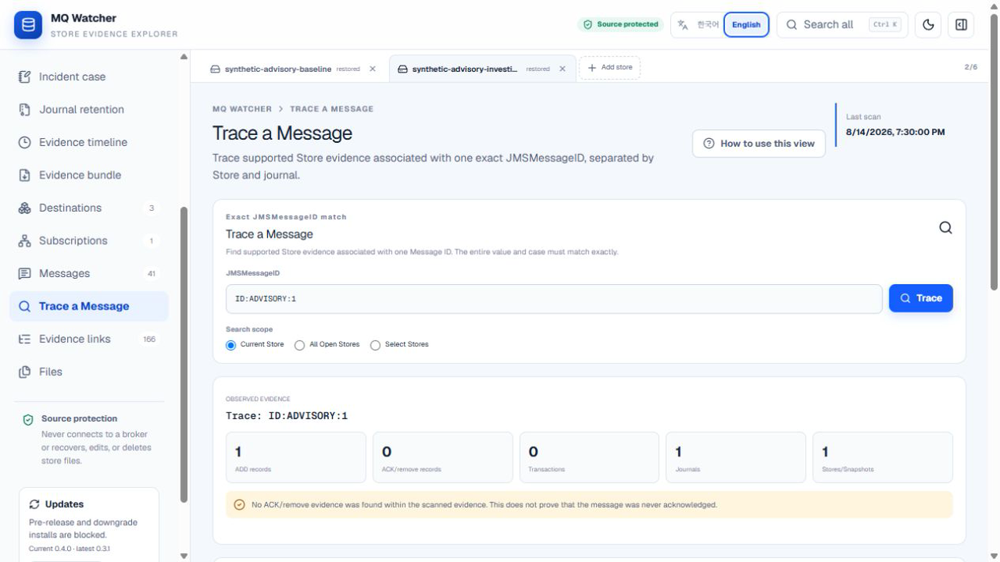

# Trace a Message

[한국어](message-trace.ko.md) | English

Trace a Message collects the Store evidence that MQ Watcher can associate with one exact `JMSMessageID`. It is a read-only investigation workflow, not a duplicate detector, redelivery detector, or root-cause engine.

## Identity rule

- Leading and trailing whitespace is removed.
- The remaining `JMSMessageID` must match in full and is case-sensitive.
- `ID:ABC:1` and `ID:ABC:10` are different identities.
- A parsed Message ID, an exact ID token observed in a raw string, and a pattern-only candidate keep their own evidence confidence.

## Search scopes

- **Current Store** searches only the active Store tab.
- **All Open Stores** searches every currently open analysis but keeps each result separate.
- **Select Stores** searches only checked Store tabs.

MQ Watcher never merges records from different Store copies into one inferred lifecycle.

## Evidence model

Supported results are classified as ADD, ACK/remove, transaction, subscription-related, raw observation, or Unknown. Every item keeps its Store signature, source file, offset where available, confidence, and semantic evidence reference. Events are ordered by offset only within the same journal. No cross-journal global chronology is created.

## Workflow

1. Open a Store and select **Trace a Message**.
2. Enter the complete `JMSMessageID` and choose a search scope.
3. Review the observed summary, then the Store- and journal-separated sequence.
4. Use **Select for case** to open the matching Store's Incident Case view with that exact evidence selected.
5. Optionally enter the same Message ID on the Evidence Bundle page to include the redacted trace summary in the ZIP.

Message detail, message rows in Snapshot Compare, message events in Evidence Timeline, and message pins in Incident Case provide direct trace entry points.

## Interpretation limits

Repeated ADD evidence does not by itself prove duplicate delivery to a consumer. A missing ACK/remove record does not prove that the message was never acknowledged. The trace does not prove successful application processing, the broker's current queue state, the exact cause of redelivery, or the incident root cause.

## Performance and source safety

Trace searches the existing in-memory scan result and does not rescan the Store. It does not request write access, start a broker, perform recovery, or upload Store content. Large result sets are paginated, and multi-Store results remain grouped by source Store.
