# MQ Watcher 사용 가이드

한국어 | [English](user-guide.md)

이 가이드는 저장소에 함께 들어 있는 `synthetic-advisory-baseline`과 `synthetic-advisory-investigation` 스냅샷을 사용합니다. 화면 탐색, 비교, 케이스 관리 기능을 쉽게 확인할 수 있도록 뒤쪽 저널에 합성 Advisory 관찰값이 집중된 상황을 구성했습니다. 브로커 적체나 장애 원인을 입증하는 자료는 아닙니다.

MQ Watcher를 시작하고 **합성 예시 불러오기**를 선택합니다. 처음 여는 작업공간은 영어로 시작하며, 이후 선택한 언어는 캐시된 분석과 조사 케이스처럼 브라우저 로컬 저장소에 보존됩니다. 포터블 실행 파일은 `http://127.0.0.1:38921`의 고정 주소를 사용하므로 실행 파일을 재시작해도 이 상태를 다시 불러옵니다. `--port 0`은 의도적으로 일회성 주소를 사용합니다.

## 모든 화면의 그림 안내

화면 제목 옆의 **이 화면 사용법**을 선택합니다. 선행 작업, 사용하면 좋은 상황, 얻을 수 있는 결과, 세 단계 읽기 흐름과 화면별 해석 한계를 함께 안내합니다. 화살표는 사건 순서나 인과관계를 의미하지 않습니다.

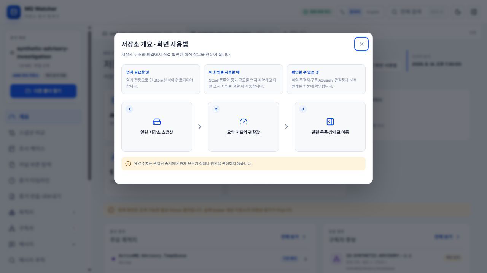

## 1. 개요

관찰된 저장소 유형, 파일 수, 목적지 후보, 구독자 후보, Advisory 문자열 수와 직접 증거 경로를 확인합니다. 요약값을 더 살펴봐야 할 때 관련 목록을 엽니다.

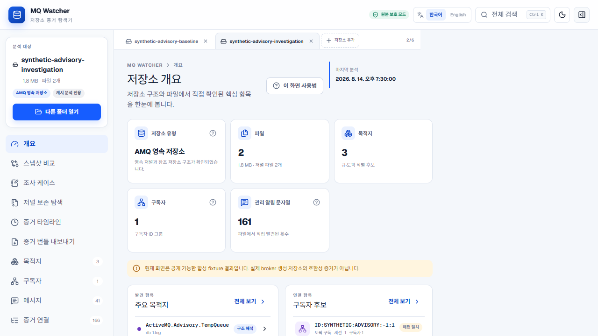

## 2. 스냅샷 비교

기준 스냅샷과 조사 스냅샷을 선택합니다. 원문 출현 횟수와 고유 의미 항목 수를 나누어 읽습니다. 경로와 오프셋은 출처 정보이며 항목의 동일성 기준이 아닙니다. 차이가 있다는 사실만으로 변경 이유를 설명할 수는 없습니다.

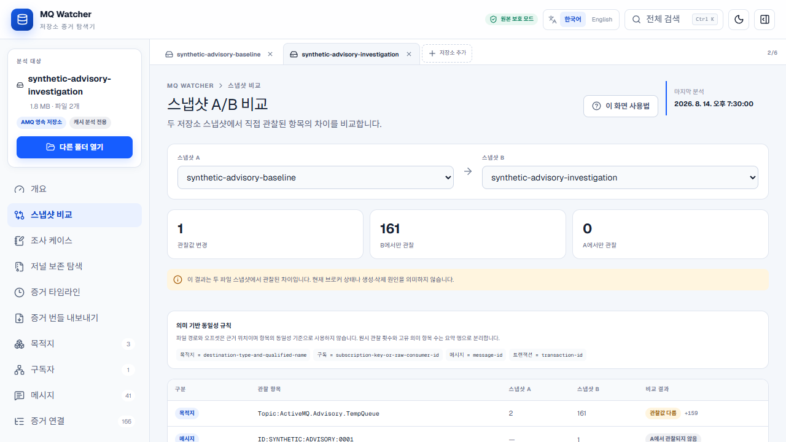

## 3. 조사 케이스

케이스를 만들고 반증 가능한 가설을 기록합니다. 증거 선택 영역에서 목적지, 구독자, 메시지, 증거 연결 또는 파일을 검색한 뒤 **고정**을 선택합니다. 고정 참조에는 저장소 서명, 의미 증거 키와 출처 정보가 저장됩니다. 케이스를 지울 때는 **케이스 삭제**를 누르고 확인합니다.

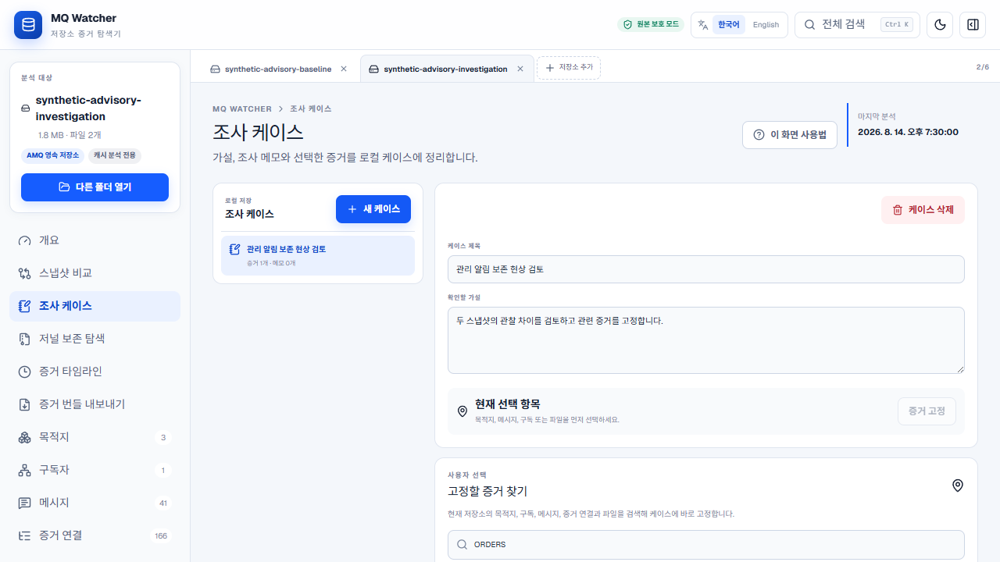

## 4. 저널 보존 탐색

저널 파일명을 선택해 역색인 상세를 엽니다. 처음 50개 참조가 표시되며 **다음 100개 불러오기**를 누르면 현재 위치부터 이어서 모든 관찰 참조를 확인할 수 있습니다. 긴 참조 문구는 잘리지 않고 줄바꿈됩니다. 이 화면은 증거가 관찰된 위치를 보여주며 저널이 보존된 이유를 판정하지 않습니다.

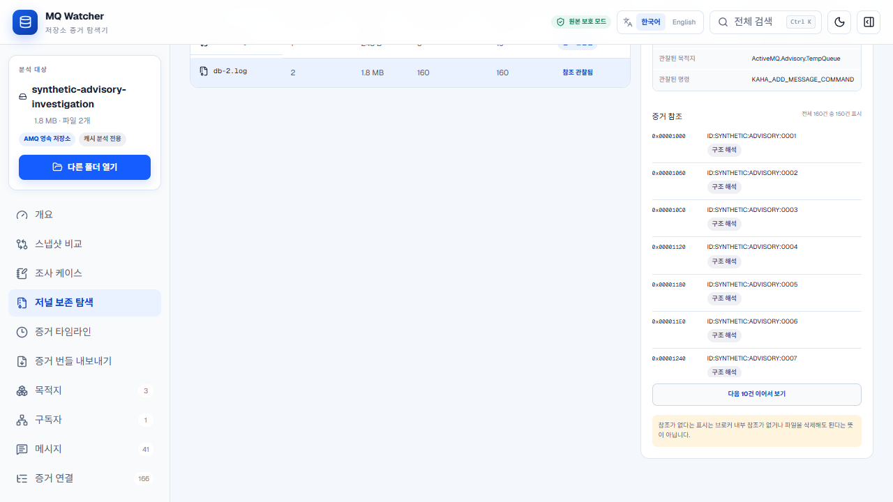

## 5. 증거 타임라인

같은 저널 안에서만 오프셋 순서를 읽습니다. 서로 다른 저널 사이의 전역 순서는 만들지 않습니다. 출처가 필요하면 행을 선택합니다.

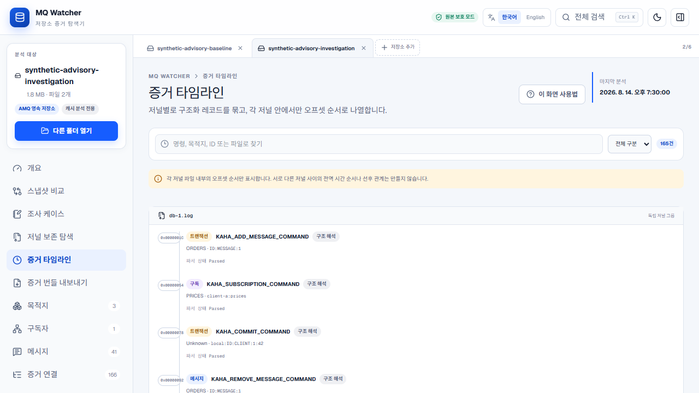

## 6. 증거 번들 내보내기

케이스와 비식별 처리 대상을 고른 뒤 내보내기를 시작하고 진행률을 확인합니다. 내보내기는 Worker에서 실행되며 취소할 수 있습니다. 비식별 처리는 우발적 노출을 줄이는 기능이므로 공유 전 ZIP을 다시 검토해야 합니다.

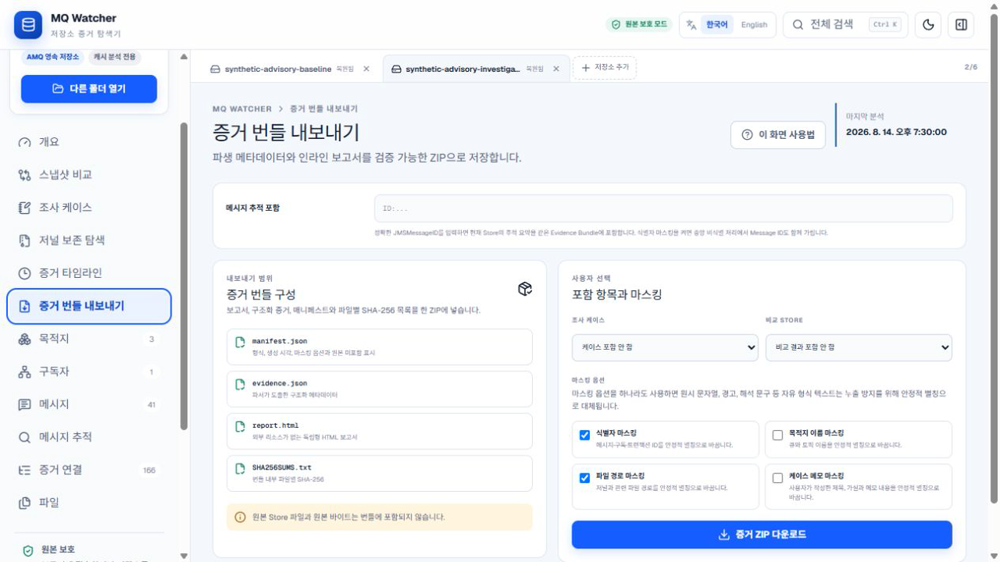

## 7. 목적지

관찰된 Queue와 Topic 후보를 검색하고 정렬합니다. 근거 수준 표시는 구조를 해석한 값, 직접 관찰한 값, 패턴이 일치한 값을 구분합니다.

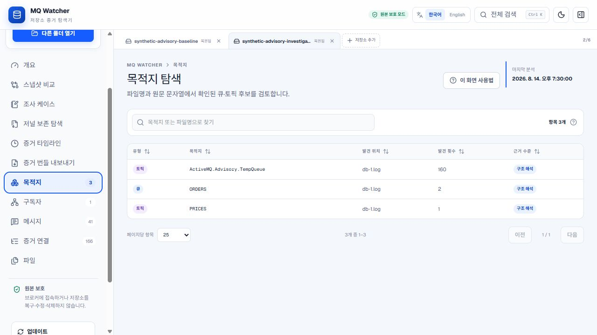

## 8. 구독자

그룹화된 Consumer ID를 검색하고 관찰된 형식이 허용하는 범위에서 필드를 확인합니다. 구독자 후보가 보인다는 사실만으로 장애 시점에 실제 동작 중이었다고 단정할 수 없습니다.

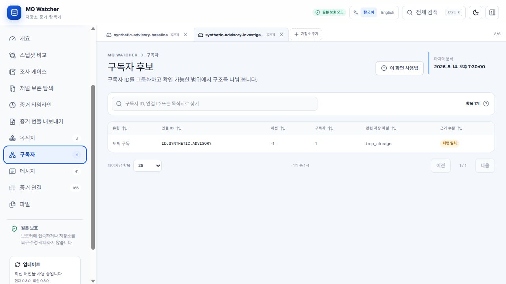

## 9. 메시지

메시지 ID와 목적지를 검색하고 표를 정렬합니다. 번호 페이지 또는 직접 페이지 입력으로 이동할 수 있습니다. 최초 2,500건을 불러온 뒤 더 많은 후보가 있고 원본 Store 접근이 유지되어 있으면 **다음 2,500건 불러오기**를 반복해 끝까지 확인합니다. 캐시 전용 세션에서는 이어 읽기 전에 원본 Store를 다시 열도록 안내합니다.

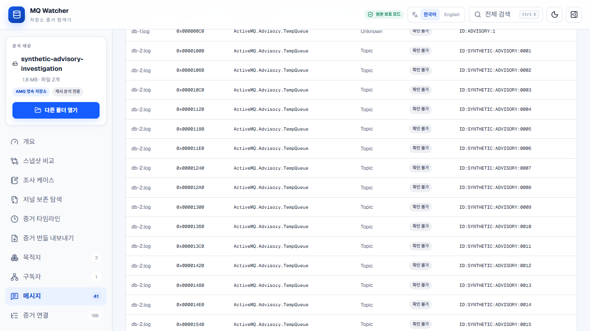

## 10. 메시지 추적

대소문자를 포함해 완전히 같은 `JMSMessageID`를 입력하고 현재 Store, 열린 모든 Store 또는 직접 선택한 Store 범위를 고릅니다. 각 Store 결과는 합치지 않고 따로 읽으며, offset 순서는 같은 journal 안에서만 순서 근거로 사용합니다. **케이스에서 선택**을 누르면 해당 Store의 조사 케이스 화면으로 이동해 그 증거를 현재 선택 항목으로 전달합니다. 식별 규칙과 해석 한계는 [메시지 추적 문서](message-trace.ko.md)를 참고하십시오.

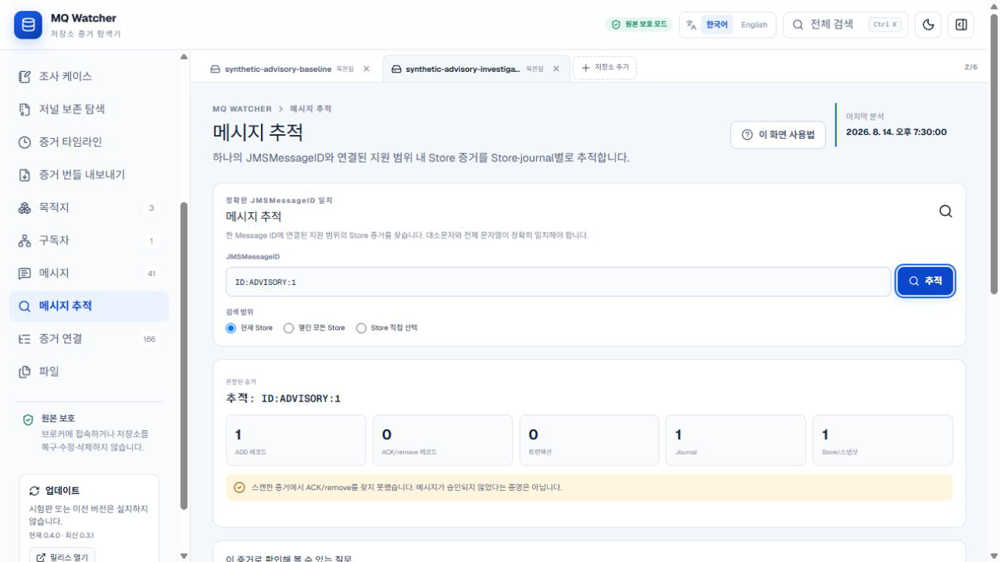

## 11. 증거 연결

ID, 목적지, 파일 또는 트랜잭션으로 구조화 관계와 원문 관계를 찾습니다. 저널과 오프셋을 따라 근거로 이동합니다. 연결은 탐색을 돕지만 장애 원인을 자동 판정하지 않습니다.

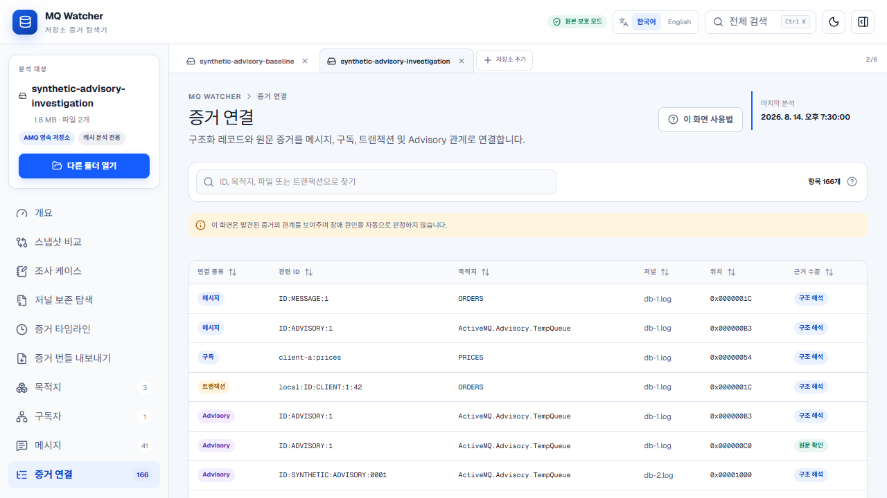

## 12. 파일

파일 역할, 크기, 수정 시각과 근거 수준을 확인합니다. 파일 수정 시각은 파일 메타데이터이며 브로커 사건의 발생 시각으로 해석하면 안 됩니다.

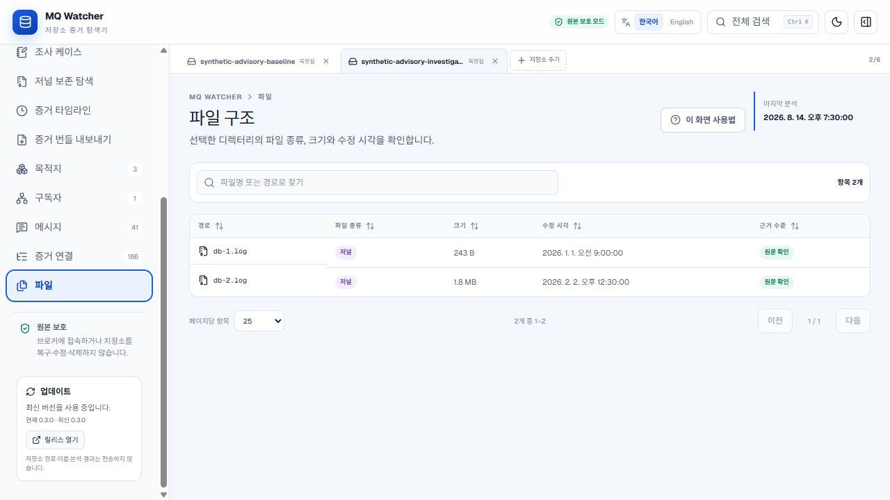

## 저장소를 열지 않은 상태

분석 메뉴는 불러오거나 복원한 결과가 필요합니다. 사용할 수 없는 분석 메뉴를 선택하면 저장소 또는 합성 예시를 먼저 열어야 한다는 토스트가 표시되며, 클릭이 아무 설명 없이 무시되지 않습니다.

## 해석 범위

합성 시나리오는 Advisory 관찰값이 집중된 상황을 조사하는 방법을 보여줍니다. 현재 브로커 pending 상태, Consumer 장애, 제품 문제 또는 인과관계를 입증하지 않습니다. 내보낸 증거를 운영 로그, 설정과 실제 배포된 ActiveMQ 버전과 함께 비교하십시오.
