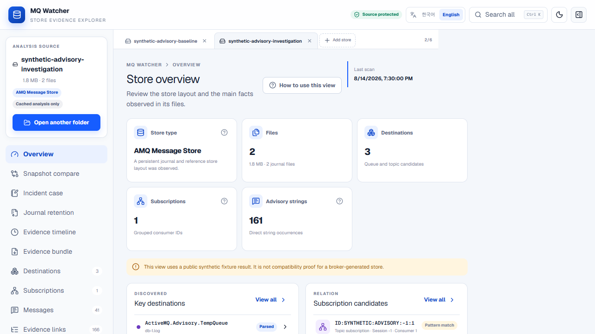
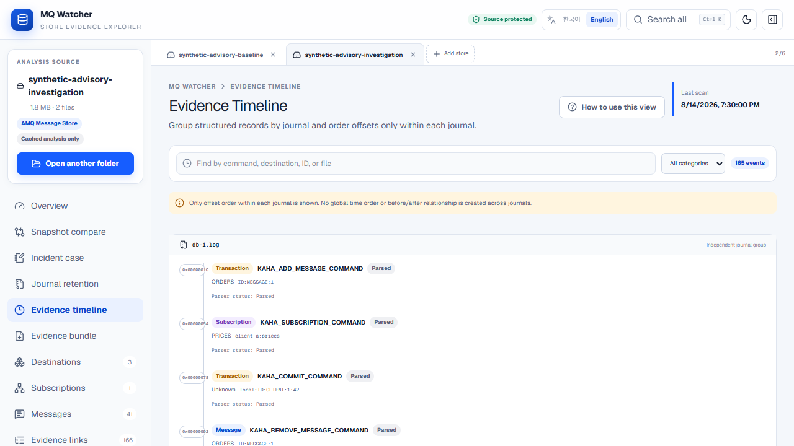
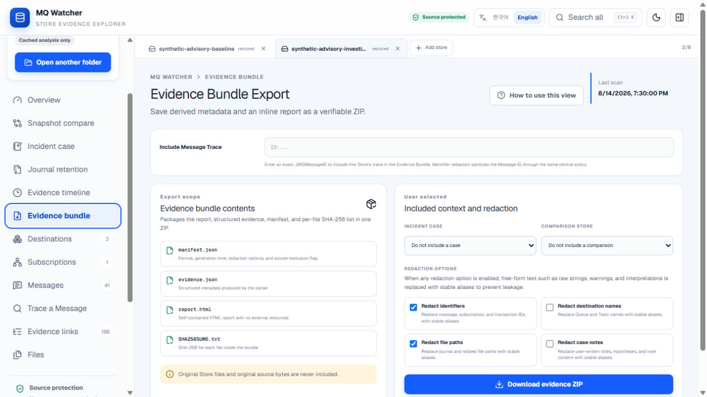
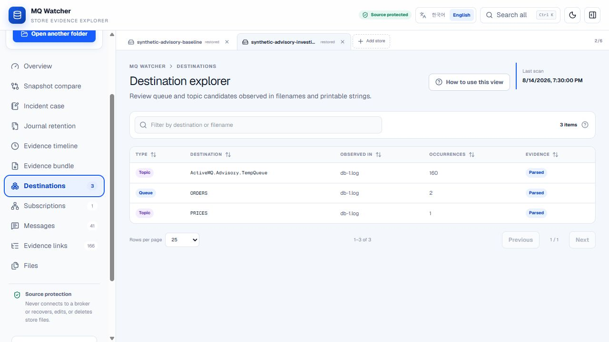
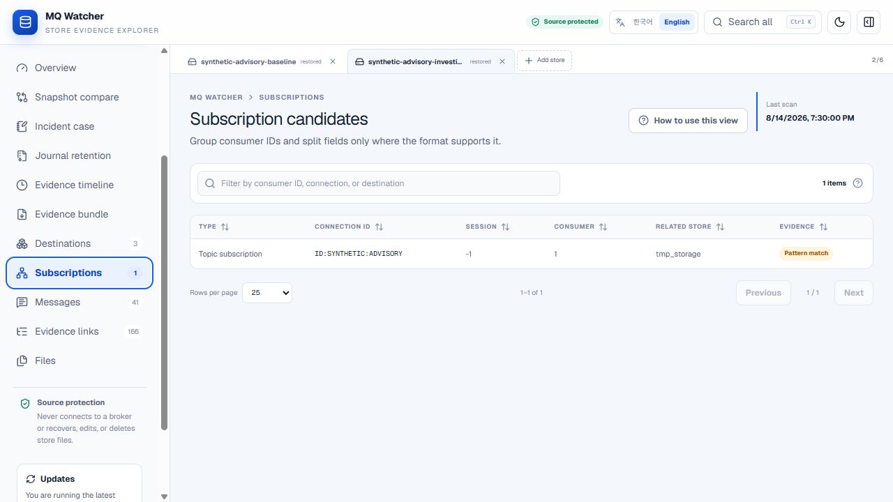
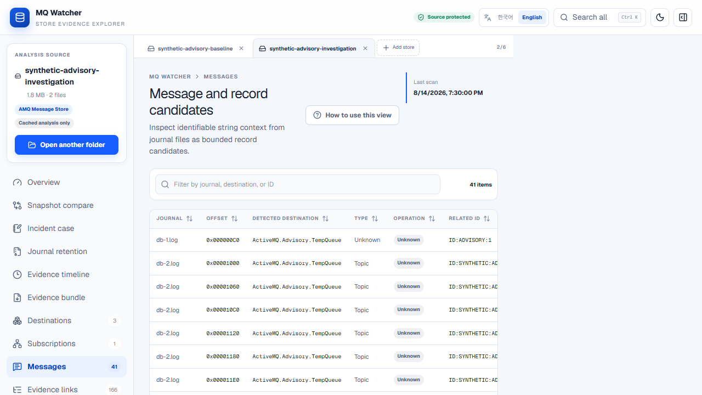
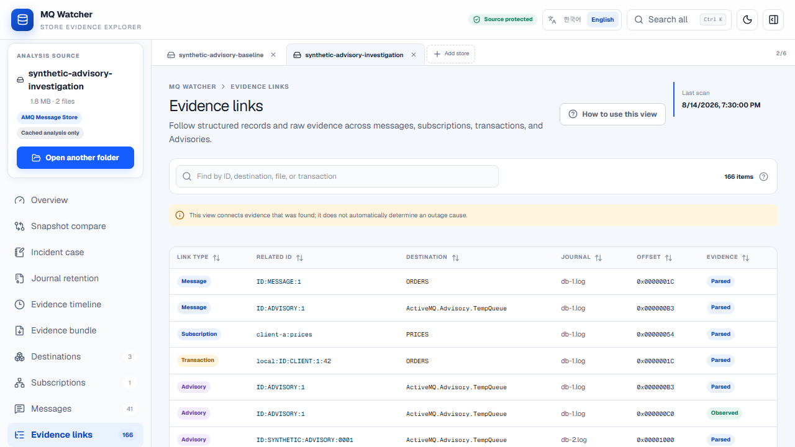
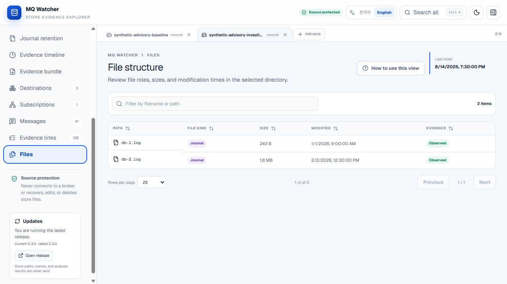

# MQ Watcher user guide

[한국어](user-guide.ko.md) | English

This guide uses the committed `synthetic-advisory-baseline` and `synthetic-advisory-investigation` snapshots. The scenario intentionally concentrates synthetic Advisory observations in a later journal so the navigation, comparison, and case-management features are easy to see. It is a UI example, not proof of a broker backlog or root cause.

Start MQ Watcher and choose **Load synthetic demo**. A first-time workspace starts in English. A language change is saved in browser-local storage, as are cached analyses and incident cases. The portable executable uses the stable loopback origin `http://127.0.0.1:38921`, so this state is available after an executable restart. `--port 0` intentionally creates an ephemeral origin.

## Visual help on every page

Select **How to use this view** beside a page title. The guide explains prerequisites, when the page is useful, what evidence it can produce, a three-step reading path, and the page-specific interpretation boundary. Its arrows do not assert event order or causality.

## 1. Overview

Use the overview to check the observed Store type, file count, destination candidates, subscription candidates, Advisory string count, and direct evidence paths. Open a related list when a summary needs inspection.

## 2. Snapshot compare

Select a baseline and an investigation snapshot. Read raw occurrence counts separately from unique semantic entities. Paths and offsets are provenance, not entity identity, and a difference does not explain why it changed.

## 3. Incident case

Create a case, record a falsifiable hypothesis, then search the evidence picker and select **Pin** on a destination, subscription, message, evidence link, or file. Pins use Store signature, semantic evidence key, and provenance. Delete a case with **Delete case** after confirming the prompt.

## 4. Journal retention

Select a journal filename to open its reverse-index detail. The first 50 references are shown; **Load next 100** continues from the current position until every observed reference is available. Long reference text wraps instead of being clipped. This view shows where evidence was observed, not why a journal is retained.

## 5. Evidence timeline

Read offsets only within the same journal. MQ Watcher does not fabricate a global order between different journals. Select a row to inspect its provenance.

## 6. Evidence bundle

Choose the case and redaction groups, start the export, and monitor progress. Export runs in a Worker and can be cancelled. Review the ZIP before sharing it; redaction reduces accidental disclosure but is not a guarantee.

## 7. Destinations

Filter and sort observed Queue and Topic candidates. Evidence labels distinguish parsed structures, direct observations, and pattern matches.

## 8. Subscriptions

Filter grouped consumer IDs and inspect fields only where the observed format supports them. A subscription candidate is evidence for investigation, not proof that it was active at failure time.

## 9. Messages

Search message identifiers and destinations, sort the table, use numbered pages or enter a page directly, and select a row when its source detail is needed. The first 2,500 candidates are loaded initially. If more evidence exists and the original Store is still available, select **Load next 2,500** repeatedly until MQ Watcher reports that all supported candidates are loaded. A cached-only session asks you to reopen the Store before continuing.

## 10. Trace a Message

Enter one complete, case-sensitive `JMSMessageID`, choose Current Store, All Open Stores, or selected Store tabs, and run the trace. Read each Store separately and treat offset ordering as authoritative only within the same journal. Use **Select for case** to carry one evidence item into that Store's Incident Case view. See [the Message Trace guide](message-trace.md) for identity and interpretation limits.

## 11. Evidence links

Search structured and raw relationships by identifier, destination, file, or transaction. Follow the journal and offset to supporting evidence. A link helps navigation; it does not automatically determine an outage cause.

## 12. Files

Review file roles, sizes, modification times, and evidence levels. Modification time is file metadata and should not be treated as a broker-event timestamp.

## When no Store is open

Analysis navigation needs a loaded or restored result. Selecting an unavailable analysis page shows a toast explaining that a Store or the synthetic demo must be opened first; the click is not silently ignored.

## Interpretation boundary

The synthetic scenario demonstrates how to investigate concentrated Advisory observations. It does not prove pending broker state, consumer failure, a product defect, or causality. Compare exported evidence with runtime logs, configuration, and the exact deployed ActiveMQ version.
